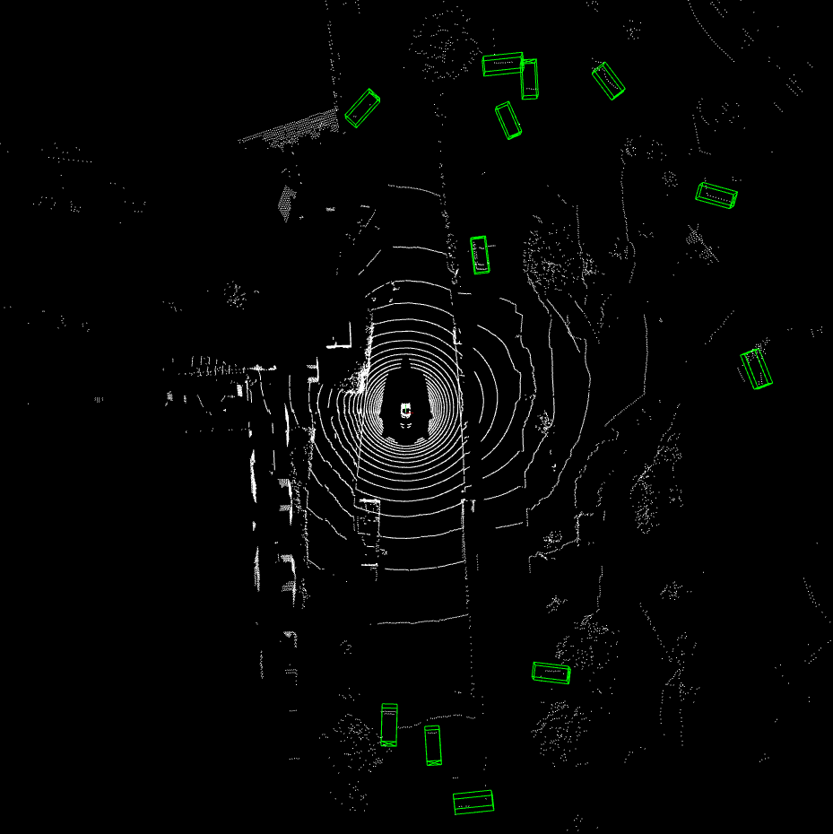

# TED tools

- This directory contains standard scripts for running tests and training models with OpenPCDet.
How to use them is described [here](../README.md) and [here](https://github.com/open-mmlab/OpenPCDet/blob/master/docs/GETTING_STARTED.md).
- In addition, this directory contains the `demo.py` script for running the detector and visualising the results.
    - The script requires the open3d library to visualise the results, so you should run it in a `ted` environment or install open3d via `pip`:
        ```bash
        pip install open3d
        ```
    - *Warning:* The script uses (imports) the `dataset_predict.py` file, which is located in the `darts-main` repository, and in this directory only the symlink to this file. Therefore, you should run the demo having a cloned `TED` repo as a `darts-main` submodule. Perhaps it would have been better if this file had been here, there would have been no need to do such tricks, but I wanted our (written by us) production code to be in our production repo.
    - Usage:
        ```
        usage: demo.py [-h] [--cfg_file CFG_FILE] [--data_path DATA_PATH] [--ckpt CKPT]

        optional arguments:
        -h, --help            show this help message and exit
        --cfg_file CFG_FILE   specify the config for demo
        --data_path DATA_PATH specify the point cloud data file or directory
        --ckpt CKPT           specify the pretrained model
        ```
    - The script should detect all point clouds in the `data_path` and detect objects using the checkpoint `ckpt`. The visualisation should look something like this:
    
